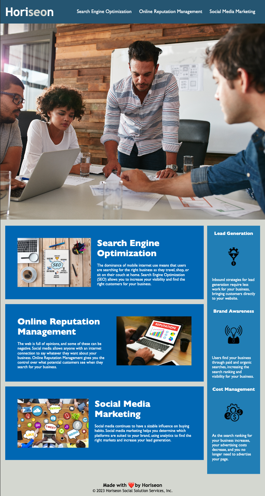

# Refactoring the marketing website

<!-- ABOUT THE PROJECT -->

<!-- TABLE OF CONTENTS -->

  
Table of Contents

  <ol>
    <li>
      <a href="#about-this-project">About this Project</a>
      <ul>
        <li><a href="#built-with">Built With</a></li>
      </ul>
    </li>
    <li><a href="#roadmap">Roadmap</a></li>
    <li><a href="#important-note">Important Note</a></li>
    <li><a href="#website-preview">Website Preview</a></li>
      <ul>
        <li><a href="#developer-note">Developer's note</a></li>
      </ul>
    <li><a href="#credits">Credits</a></li>
    <li><a href="#license">License</a></li>
    <li><a href="#contact">Contact</a></li>
  </ol>

## About this project

This marketing website, Horiseon Social Solution Service, Inc., has some problems for HTML tags that do not follow the semantic structure of the HTML elements. This may have significant impacts on SEO for their domain and the web accessibility.

To solve these potential problems, this projects is here t help and fix their HTML element tags that work better in the SEO which follows the semantic HTML.

From the SEO point of views, this website should be the responsible website because searcn engines evaluate the website's mobile display.

### Built With

- ![HTML]
- ![CSS]

## Roadmap

- [x] Semantic HTML elements can be found throughout the source code
- [x] HTML elements follow a logical structure independent of styling and positioning
- [x] Image and icon elements contain accessible alt attributes
- [x] Heading attributes fall in sequential order
- [x] Title elements contain a concise, descriptive title

## Important note

This is entirely a mock-up site for the bootcamp project. This compnay or its contents have no relation to any real individulas or organizations.

### Website Preview

This preview shows at the width of 1080px

##### Developer note

This company website is not a responsive website for a tablet or a smartphone display. The code for the website supports the display that has the width of 1080px or above.

### Credits

This is a mock-up website for the bootcamp. The images and its codes are not copyrigt free. No third party plugins.

### License

Distributed under the MIT License. See `LICENSE.txt` for more information.

## Contact

Tak Kawamura - [@\_takuyakawamura](https://twitter.com/_takuyakawamura) - tkawamura11@gmail.com

<!-- MARKDOWN LINKS & IMAGES -->
<!-- https://www.markdownguide.org/basic-syntax/#reference-style-links -->

[HTML]: https://img.shields.io/badge/HTML-orange
[CSS]: https://img.shields.io/badge/CSS-blue
